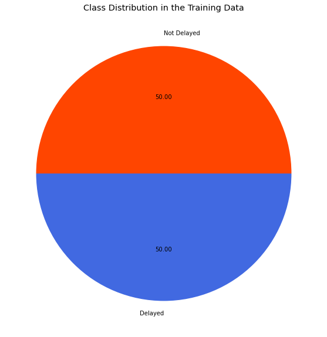
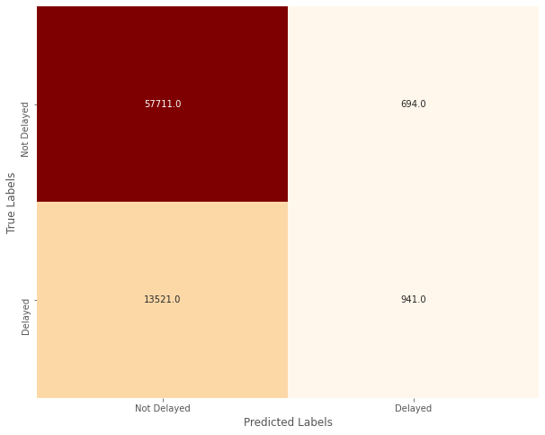

# What's My Flight Status?: Using Flight Data to Predict Flight Delays

**Author**: Andre Layton  
GitHub: @therookiescientist-andre

Final Notebook: [Notebook](/flight_status.ipynb)\n
Presentation: [Presentation](/presentation.pdf)

## Overview
  The *Wall Street Journal* recently released their annual airlines rankings, where United Airlines dropped out of the top five. (McAllister, 2024) Now at \#6 due to a variety of issues, including recent plane troubles (i.e., the Boeing 737s over the last few years), the company’s executive team decided to tackle the issues with growing flight delays to regain consumer confidence. I’ve been hired to create an algorithm that can predict flight delays, using flight data from Kaggle.com that contains airport, airline, and weather information. The aim is to deploy an app that consumers can use for better travel planning and take pre-emptive measures in flight delay situations. Using deep learning and neural networks, my model is 30.3% precise in classifying flights as delayed or not delayed, and will continue to be tuned to reduce the amount of false positive cases. 
  
  

## Business Understanding 
   Flight delays are gradually increasing; they bring along financial difficulties and breed dissatisfaction from both passengers and carriers alike. In fact, according to the Bureau of Transportation Statistics, 20.25% of flights across all carriers were delayed in 2023, which is an increase from pre-pandemic levels (18.72% of flights in 2019). (FAA, 2024) Obviously, for passengers, delays are a major inconvenience, and can create further travel issues that can potentially deter passengers from booking with that airline in the future. For the carriers, delays can be quite expensive if we consider the reimbursements to passengers, tarmac fees when planes remain longer than scheduled, client compensation and accommodations if needed, etc. (Hostetler, 2023) The damage to the carrier's reputation is also a concern, which can directly impact sales and stock valuations. To resolve this issue, supervised learning models - machine learning algorithms and neural networks, specifically - were implemented to predict flight delays.
   This is important for both the airline and potential passengers – for the airline, it will help with flight logistics and reduce fees due to delays (i.e. tarmac fees, reimbursements, etc.). For passengers, the app will allow them to make delay arrangements and take measures ahead of time, and possibly save on delay expenses. Delays are frustrating whether expected or not; however, United aims to use this strategy to display company honesty and gain more control over their flights. It is important to note that delays can be divided into departure and arrival delays. For simplicity, my analysis will only consider **departure delays**, which the Federal Aviation Administration (FAA) defines as a flight departing 15 minutes (or more) past its scheduled time. 
***
## Data Understanding & Methods
   The dataset, which is available on Kaggle (the link located further below), is comprised of data provided by the Bureau of Transportation and the National Centers for Environmental Information (NOAA). It is split into two files: a CSV file containing monthly data from the year 2019 with detailed airline, weather, and airport information; and a text file containing metadata, including the column names and a brief description of each feature. Fortunately, the target variable (`'DELAYED'`) is already formed within the dataset. There are over 6 million records in the original data, and 26 features, including the aforementioned target column. However, I am only interested in those provided by United Airlines. I filter my dataset with that in mind, and reduce it to 600,000 observations. After some further data cleaning (i.e. dropping duplicates, renaming/dropping columns, OneHotEncoding, etc.), I look into the distributions of the features and the target variable. I see there is a class imbalance in my target data (as shown in the left pie plot below), so I apply undersampling techniques to even the ratio of delayed and not delayed flights (shown in the right pie plot). When applying the sampler function in a pipeline, I had to import `imblearn`'s pipeline rather than scikit-learn's version because the latter does not fit and transform when sampler methods are included; therefore, it is necessary to import the former's pipeline version.
   
   
   
   I end my data preparation by splitting the dataset into training, validation, and testing sets - the first two will be iterated through my modeling process.    
***
## Modeling
   I begin modeling by cross-validating four baseline models, and evaluating them based on precision, recall, and f1 scores. My main focus is to improve precision, which affects the false positive count. The false positive count, in this case, represents the number of on-time flights predicted as delays. This is crucial because if not addressed properly, the model could spread misinformation, and lead to passengers missing their on-time flights. This would lead to further consumer disapproval, and hurt the company's sales and reputation. However, I will still track the recall score (or the number of false negatives), and the f1 score, which is the harmonic mean of precision and recall. The baseline model with the best trio of average metric scores will be selected to undergo hyperparameter tuning and further evaluation. I will take that baseline model and tune the hyperparameters for optimal performance, then evaluate based on those optimal parameters. I also take a look into neural networks, and utilizing deep learning methods to possibly achieve the "best" model. I will use the scores and confusion matrices as performance measures to select the final model. 

   

   The best determined model at predicting flight delays is the final neural network I built, with 30.3% precision. My initial baseline model (prior to tuning) was only 24.5% precise - a slight improvement. I used a stopping condition when training the final model, and saved it as `best_model.h5`, which is also located in this repository. The visual above shows that out of the 72,867 predictions, 19,183 were false positives. This leaves much to be desired and room for improvement. Much of this can be attributed to the limitations I discuss in the next section. 
   
***
## Results & Conclusions
This analysis leads to the following conclusions:

   1. The neural networks performed better than the machine learning algorithms I tested, and is the path I will explore further as I aim to improve my performance.

   2. The model is 30.3% precise when testing and classifying flights as delayed or not delayed.

This project is limited in a few ways. First and foremost, I built my models under heavy computational constraints. Given the nature of the data, it is necessary to train models on computers that can process large and full datasets in quicker time. For example, the grid search I performed earlier took four hours to run, which hinders me from further testing and modifications. Another drawback is the class imbalance. I applied sampling methods to reduce the majority class, which made training the model easier (less data), but also removed information that may have been necessary. Therefore, gathering more data that fall in the minority class would greatly improve my precision. Lastly, and this ties with my computational constraints, I could have used a wider range of hyperparameters to perform my grid search with. Unfortunately, with limited resources, it would have taken me hours or even days to fully perform this search. However, if I had, I could have found a better set of hyperparameters that would drive up my precision.

Further analyses could yield a more effective predictor, and possibly improve the algorithm's performance. Some possible courses of action I could take include:

   1. Training my model with better, stronger computer(s).
   2. Gathering more data with an emphasis on balancing the minority class to avoid sampling.
   3. Reducing the dimensions of my data to focus solely on weather or departing airports, in order to gain a more informative look at how certain features affect my predictions and precision.

***
## Links & Reproducibility
For those that would like to reproduce my analysis, or begin their own, here is a link to the original dataset, available on Kaggle.com:
https://www.kaggle.com/datasets/threnjen/2019-airline-delays-and-cancellations/data

This repository relies on the data from Kaggle.com. To download the datasets, first select the website link above. Click "Download" at the right corner. This will download one .zip file to your computer, and might take a couple of minutes depending on your download speed. Unzip the file using WindowsLinks, or any relevant utility for your computer. Then after unzipping you should see files named `full_data_flightdelay.csv`, `raw_data_documentation.txt`, `train.csv`, `test.csv`, and `train_sets_documentation.txt`. I worked with the first two files for my analysis, and deleted the remaining three; however, for anyone looking to start their own analysis, select and move the relevant files into the `data/` directory of this repository.

***
## Works Cited
  Hostetler, Sarah. “United Flight Delay Compensation—How to Get It – Forbes Advisor.” Www.forbes.com, 27 Dec. 2023, www.forbes.com/advisor/credit-cards/travel-rewards/united-delayed-flight-compensation/. Accessed 10 Apr. 2024.
  
  McAllister, D. G., Allison Pohle and Kevin. (n.d.). The Best and Worst Airlines of 2023. WSJ. https://www.wsj.com/lifestyle/travel/best-airlines-us-2023-36e9ea20

  “Types of Delay - ASPMHelp.” Aspm.faa.gov, aspm.faa.gov/aspmhelp/index/Types_of_Delay.html.
***
## Repository Contents
Below is a list of the contents of this repository.

```
├── README.md             
├── images   
├── .gitignore
├── PDF_deliverables                              
├── environment.yml
├── flight_status.ipynb   
├── presentation.pdf 
└── best_model.h5